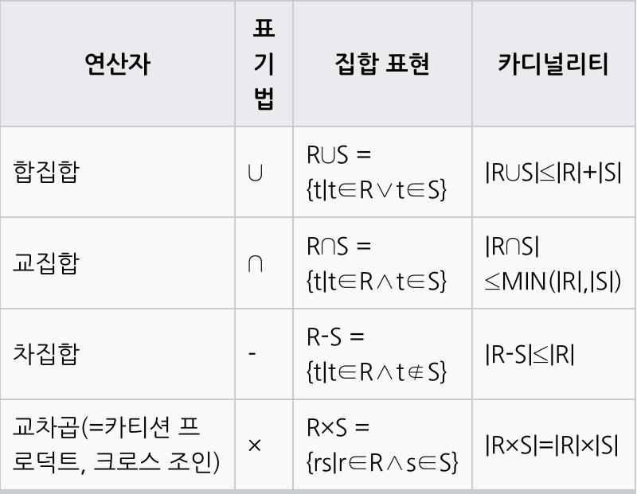
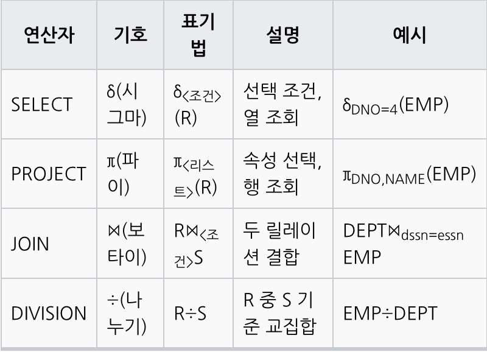

# 1. 관계형 데이터베이스 개요

## 1.1 데이터베이스란?

> **데이터베이스**([영어](https://ko.m.wikipedia.org/wiki/%EC%98%81%EC%96%B4): database, **DB**)는 여러 사람이 공유하여 사용할 목적으로 체계화해 통합, 관리하는 [데이터](https://ko.m.wikipedia.org/wiki/%EB%8D%B0%EC%9D%B4%ED%84%B0)의 [집합](https://ko.m.wikipedia.org/wiki/%EC%A7%91%ED%95%A9)이다.[[1]](https://ko.m.wikipedia.org/wiki/%EB%8D%B0%EC%9D%B4%ED%84%B0%EB%B2%A0%EC%9D%B4%EC%8A%A4#cite_note-1) 작성된 목록으로써 여러 **데이터 베이스 관리 시스템**(DBMS)의 통합된 정보들을 저장하여 운영할 수 있는 공용 데이터들의 묶음이다. 데이터베이스에 속해 있는 모델은 다양하다. [위키백과]
> 

**관계형 데이터베이스:** 현재 기업 대다수에서 사용하고 있는 데이터베이스는 객체 지원 기능이 추가된 객채 관계형 데이터베이스입니다. SQL 문장을 통해서 관계형 데이터베이스를 조작할 수 있습니다. 파일 시스템의 파일은 많은 사용자가 동시에 입력•수정•삭제할 수 없습니다 (조회만 가능). 동시에 작업하려면 다수의 복사본이 발생하게 됩니다. 분산된 데이터 간 정합성 유지에 많은 비용이 발생하게 됩니다 (단 처리 성능이 좋음). 관계형 데이터베이스는 동시성 관리와 병행 제어를 통해서 보다 많은 사용자가 동시에 작업할 수 있능 기능을 제공합니다. 추가로 메타 데이터 관리 기능, 보안 기능, 데이터 복귀 기능이 있습니다.

## 1.2 SQL

> **SQL**([/ˈɛs kjuː ˈɛl/](https://en.wikipedia.org/wiki/Help:IPA_for_English),[[1]](https://ko.m.wikipedia.org/wiki/Sql#cite_note-learningSQL-1) 또는 [/ˈsiːkwəl/](https://en.wikipedia.org/wiki/Help:IPA_for_English), Structured Query Language[[2]](https://ko.m.wikipedia.org/wiki/Sql#cite_note-2)[[3]](https://ko.m.wikipedia.org/wiki/Sql#cite_note-3)[[4]](https://ko.m.wikipedia.org/wiki/Sql#cite_note-4)[[5]](https://ko.m.wikipedia.org/wiki/Sql#cite_note-5), 구조화 질의어, S-Q-L[[6]](https://ko.m.wikipedia.org/wiki/Sql#cite_note-6))은 [관계형 데이터베이스 관리 시스템](https://ko.m.wikipedia.org/wiki/%EA%B4%80%EA%B3%84%ED%98%95_%EB%8D%B0%EC%9D%B4%ED%84%B0%EB%B2%A0%EC%9D%B4%EC%8A%A4_%EA%B4%80%EB%A6%AC_%EC%8B%9C%EC%8A%A4%ED%85%9C)(RDBMS)의 데이터를 관리하기 위해 설계한 특수 목적의 [프로그래밍 언어](https://ko.m.wikipedia.org/wiki/%ED%94%84%EB%A1%9C%EA%B7%B8%EB%9E%98%EB%B0%8D_%EC%96%B8%EC%96%B4)이다. 관계형 데이터베이스 관리 시스템에서 자료의 검색과 관리, [데이터베이스 스키마](https://ko.m.wikipedia.org/wiki/%EB%8D%B0%EC%9D%B4%ED%84%B0%EB%B2%A0%EC%9D%B4%EC%8A%A4_%EC%8A%A4%ED%82%A4%EB%A7%88) 생성과 수정, 데이터베이스 객체 접근 조정 관리를 위해 고안하였다. 많은 수의 데이터베이스 관련 프로그램들에서 SQL을 표준으로 채택하였다. [위키백과]
>

- **SQL 사용 목표:** 정확한 데이터 출력
- **SQL 튜닝의 목표:** 시스템에 큰 영향을 주는 SQL을 효과적으로 작성

### 1.2.1 SQL 문장의 종류

| 명령어의 종류 | 명령어 | 설명 |
| --- | --- | --- |
| DML (데이터 조작어) | SELECT, INSERT, UPDATE, DELETE | 데이터 조회/삽입/삭제/갱신 |
| DDL (데이터 정의어) | CREATE, ALTER, DROP, RENAME | 데이터 구조 정의 |
| DCL (데이터 제어어) | GRANT, REVOKE | 객체 권한 부여 및 회수 |
| TCL (트랜잭션 제어어) | COMMIT, ROLLBACK | DML에 의해 조작된 결과를 작업 단위로 제어 |

## 1.3 SQL 표준 개요

### 1.3.1 일반 집합 연산자

<figure>

<figcaption>나무위키</figcaption>
</figure>

- **UNION:** 수학적 합집합을 제공합니다. 현재의 SQL에서 UNION, UNION ALL 기능으로 제공됩니다. UNION의 경우 사전에 정렬 작업이 수행되므로 동일 출력 건수라면 UNION ALL 사용을 고려합니다:
- **INTERSECTION:** 수학적 교집합을 제공합니다. 현재의 SQL에서 INTERSECT 기능으로 제공됩니다.
- **DIFFERENCE:** 수학적 차집합을 제공합니다. 현재의 SQL에서 EXCEPT(Oracle은 MINUS) 기능으로 제공됩니다.
- **PRODUCT:** 수학적 곱집합을 제공합니다. 현재의 SQL에서 CROSS JOIN 기능으로 제공됩니다.

### 1.3.2 순수 관계 연산자

<figure>

<figcaption>나무위키</figcaption>
</figure>

- **SELECT:** 현재의 SQL에서 WHERE 절의 조건절 기능으로 제공됩니다 (연산과 절을 구분해서 기억합시다).
- **PROJECT:** 현재의 SQL에서 SELECT 절의 Column 선택 기능으로 제공됩니다.
- **(NATURAL) JOIN:** 현재의 SQL에서 다양한 JOIN 기능으로 제공됩니다.
- **DIVIDE:** 현재의 SQL에서 제공하지 않습니다.

## 1.4 테이블

### 1.4.1 테이블이란?

> [관계형 데이터베이스](https://ko.m.wikipedia.org/wiki/%EA%B4%80%EA%B3%84%ED%98%95_%EB%8D%B0%EC%9D%B4%ED%84%B0%EB%B2%A0%EC%9D%B4%EC%8A%A4)와 [플랫 파일 데이터베이스](https://ko.m.wikipedia.org/wiki/%ED%94%8C%EB%9E%AB_%ED%8C%8C%EC%9D%BC_%EB%8D%B0%EC%9D%B4%ED%84%B0%EB%B2%A0%EC%9D%B4%EC%8A%A4)에서 **테이블**(table)은 세로줄과 가로줄의 모델을 이용하여 정렬된 데이터 집합(값)의 모임이다.
> 
> 
> 테이블 내의 데이터는 물리적으로 데이터베이스에 저장되지는 않는다. [뷰](https://ko.m.wikipedia.org/wiki/%EB%B7%B0_(%EB%8D%B0%EC%9D%B4%ED%84%B0%EB%B2%A0%EC%9D%B4%EC%8A%A4)) 또한 관계형 테이블이지만 이들의 데이터는 쿼리 시간에 계산된다. 다른 예로 별명(nickname)이 있는데 이는 다른 데이터베이스의 표를 가리키는 포인터를 나타낸다. [위키백과]
> 

관계형 데이터베이스의 기본 단위는 테이블입니다. 모든 데이터는 테이블 속에 저장됩니다. 그리고 우리는 테이블에서 원하는 데이터를 조회합니다.

테이블은 특정한 주제와 목적으로 만들어지는 일종의 집합입니다. 우리가 많이 사용하는 EXCEL의 sheet와 많이 닮았습니다.

## 1.5 ERD

### 1.5.1 ERD란?

> [데이터 모델링](https://ko.m.wikipedia.org/wiki/%EB%8D%B0%EC%9D%B4%ED%84%B0_%EB%AA%A8%EB%8D%B8%EB%A7%81) 분야에서 **개체-관계 모델**이란 구조화된 데이터에 대한 일련의 표현이다.
> 
> 
> 서로 관계된 두 개의 엔티티
> 
> 
> 
> "구조"화된 [데이터](https://ko.m.wikipedia.org/wiki/%EB%8D%B0%EC%9D%B4%ED%84%B0)를 저장하기 위해 [데이터베이스](https://ko.m.wikipedia.org/wiki/%EB%8D%B0%EC%9D%B4%ED%84%B0%EB%B2%A0%EC%9D%B4%EC%8A%A4)를 쓴다. 이 데이터의 "구조" 및 그에 수반한 제약 조건들은 다양한 기법에 의해 설계될 수 있다. 그 기법 중 하나가 **개체-관계 모델링**(Entity-Relationship Modelling)이다. 줄여서 **ERM**이라고 한다. ERM 프로세스의 산출물을 가리켜 **개체-관계 다이어그램**(Entity-Relationship Diagram)이라 한다. 줄여서 **ERD**라 일컫는다. [데이터 모델링](https://ko.m.wikipedia.org/wiki/%EB%8D%B0%EC%9D%B4%ED%84%B0_%EB%AA%A8%EB%8D%B8%EB%A7%81) 과정은 [데이터 모델](https://ko.m.wikipedia.org/wiki/%EB%8D%B0%EC%9D%B4%ED%84%B0_%EB%AA%A8%EB%8D%B8)을 그림으로 표현하기 위해 [표시법](https://ko.m.wikipedia.org/w/index.php?title=%ED%91%9C%EC%8B%9C%EB%B2%95&action=edit&redlink=1)을 필요로 한다. ERD는 개념적 데이터 모델 혹은 시맨틱 데이터 모델의 한 타입이다. [위키백과]
> 

### 1.5.2 ERD의 구성 요소

- 엔터티
- 관계
- 속성

### 1.5.3 Meta 시스템 설정 정보(DBMS, Schema) 테이블의 관계

- 하나의 DBMS는 여러 개의 Schema를 포함할 수 있습니다.
- 하나의 Schema는 하나의 DBMS에 꼭 속해야 합니다.
- 하나의 Schema는 하나의 테이블스페이스와 하나의 인덱스스페이스를 꼭 가집니다.
- 하나의 DBMS는 하나의 DBMS와 관계를 맺습니다.

## 1.6 데이터 유형

데이터베이스에서 사용되는 데이터의 유형은 다양합니다. 벤더별로 SQL 문장의 차이는 작지만, 데이터 유형과 내장 함수의 차이는 큽니다. Meta 시스템에서는 논리 데이터 타입과 DBMS의 물리 데이터 타입 간 매핑 정보를 바탕으로 DDL을 생성합니다.

### 1.6.1 데이터 유형 (ANSI/ISO)

| 데이터 유형 | 설명 |
| --- | --- |
| CHARACTER(len), CHAR(len) | 고정 길이 문자열, len는 기본 길이 1byte 입니다. |
| VARCHAR(len) | 가변 길이 문자열, len는 최소 길이 1byte 입니다. |
| BOOLEAN | 논리값인 True(1)와 False(0) 중 한 가지만을 가집니다. |
| INTEGER, INT | 정수, 만약 소수 부분을 포함한 데이터가 들어오려고 한다면 소수 부분이 제거되어 저장됩니다. |
| DECIMAL[(p[,s])], DEC[(p[,s])] | NUMERIC과 기능적으로 동일합니다. |
| NUMERIC[(p[,s])] | 정수 및 실수, p는 정수 부분이고 s는 소수 부분입니다. |
| DATE | 날짜 정보 |
| TIMESTAMP | 날짜와 시각 정보 |
| CLOB | 대용량 문자열 데이터, DBMS별로 최대값이 상이합니다. |
| BLOB | 대용량 이진 데이터, DBMS별로 최대값이 상이합니다. |

# 2. SQL 기본, 활용은 링크 참조

* [SQL 기본](http://localhost:4000/notes/kr/sql-developer/chapter-03)
* [SQL 활용](http://localhost:4000/notes/kr/sql-developer/chapter-04)

 
 
References   
SQL 전문가 가이드(2020 개정판)   
[https://dataonair.or.kr](https://dataonair.or.kr/)   
[https://www.wikipedia.org](https://www.wikipedia.org/)